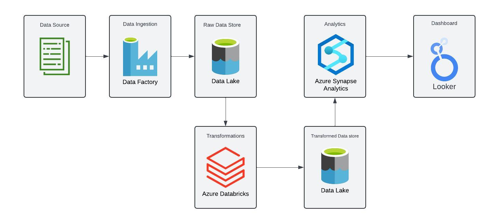
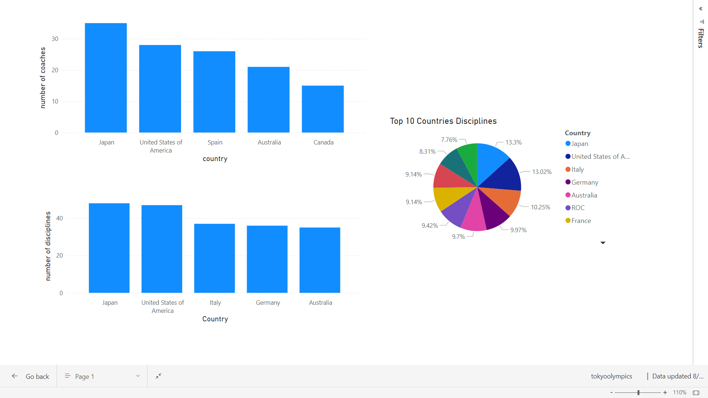

# Azure Data Engineering Project: Tokyo Olympics 2020

## introduction
This project aims to analyze data from the Tokyo 2020 Olympics using Microsoft Azure tools. Key technologies include Azure Databricks for data processing, Azure Synapse Analytics for analytics, Azure Data Factory for data integration, and Azure Data Lake Storage Gen2 for scalable storage. The objective is to extract valuable insights and trends from the data.

## Architecture

## Technology Used
1. Programming Language: Python
2. Cloud: Azure
   - Azure Data Factory
   - Data Lake Storage Gen2
   - Azure Databricks
   - Azure Sunapse Analytics
3. Looker Studio

## Dataset
The Tokyo Olympics dataset includes CSV files covering various aspects such as athletes, coaches, teams, medals, and gender-based entries. This comprehensive data provides insights into the participation and performance details from the 2020 Tokyo Olympics.

Dataset used - https://github.com/hansolo-N/Azure_DE_Olympics/tree/main/data

## Analysis
1. The total number of events for both men and women were approximately the same, with men having having participated in slightly more events
   - Men: 120 events
   - Women: 114 events
2. Teams with the most gold medals
   - The USA won the most with 39 gold medals
   - China second with 38 gold medals
   - Japan with 27 gold medals
3. Disciplines
   - Athletics had the most participants with 2041 contestants
   - Cycling BMX freestyle had the least with 19 contestants

## Visualizations

